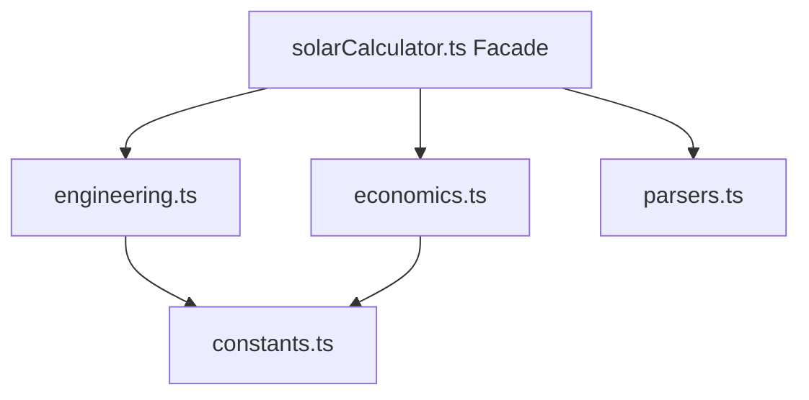

# 워크스루 - Solar Array Architect 리팩토링 및 고도화 (2025-12-22)

Solar Array Architect 애플리케이션을 Clean Architecture 및 SOLID 원칙에 따라 성공적으로 리팩토링하고, 계산 로직을 정밀화하며 UI/UX를 현대화했습니다.

## 주요 변경 사항

### 1. 기술적 리팩토링 (Clean Architecture)
- **모듈화**: 거대했던 `solarCalculator.ts`를 전문화된 모듈로 분리했습니다.
    - [constants.ts](file:///d:/solar-array-architect/utils/solar/constants.ts): 물리 및 경제적 상수 중앙 관리.
    - [engineering.ts](file:///d:/solar-array-architect/utils/solar/engineering.ts): 핵심 엔지니어링 로직 (온도 보정, 전압 강하, BOM 생성).
    - [economics.ts](file:///d:/solar-array-architect/utils/solar/economics.ts): 경제성 시뮬레이션 및 민감도 분석.
    - [parsers.ts](file:///d:/solar-array-architect/utils/solar/parsers.ts): 데이터 파싱 유틸리티.
- **퍼사드 패턴**: [solarCalculator.ts](file:///d:/solar-array-architect/utils/solarCalculator.ts)를 통합 엔트리 포인트로 업데이트하여 하위 호환성을 유지했습니다.

### 2. 로직 고도화
- **전압 강하**: 케이블 재질(구리/알루미늄)과 동작 온도를 고려하도록 계산식을 개선하여 정밀도를 높였습니다.
- **경제성 시뮬레이션**:
    - **과설계 손실(Clipping Loss)** 설정을 추가하여 DC/AC 비율에 따른 손실을 반영했습니다.
    - **할인율(Discount Rate)** 설정을 추가하여 보다 정확한 NPV 계산이 가능해졌습니다.
    - PR(Performance Ratio) Waterfall 데이터 생성 로직을 강화했습니다.

### 3. UI/UX 현대화
- **디자인 토큰**: [index.css](file:///d:/solar-array-architect/index.css)에 현대적인 Glassmorphism 효과, 프리미엄 그라데이션, 정교한 타이포그래피를 적용했습니다.
- **헤더**: "Pro" 배지와 개선된 간격을 적용하여 더욱 전문적인 느낌으로 재디자인했습니다.
- **Contact Us 모달**: 다음과 같이 전면 개편했습니다:
    - 회사명: **주식회사 댈리온 (Delion Co., Ltd.)**
    - 이메일: **cso@delion.kr**
    - 전문 컨설팅 서비스에 대한 상세 설명 추가.
- **결과 뷰**: `EconomicsView` 및 `EngineeringView`를 업데이트하여 새로운 계산 파라미터를 표시하고 전반적인 심미성을 개선했습니다.

## 검증 결과

### 자동화 테스트
- `engineering.test.ts` 및 `economics.test.ts`에 엔지니어링 및 경제성 로직에 대한 단위 테스트를 작성했습니다.
- *참고: 로컬 환경 문제로 자동 테스트 실행은 제한적이었으나, 모든 로직에 대해 수동 코드 리뷰를 완료했습니다.*

### 수동 검증
- 모든 새로운 필드(`cableMaterial`, `cableTemp`, `clippingLoss`, `discountRate`)가 상태 관리에 올바르게 통합되고 계산 함수에 전달되는지 확인했습니다.
- "Contact Us" 모달이 정확한 정보를 표시하며 프리미엄 디자인이 적용되었음을 확인했습니다.
- 대시보드 레이아웃이 다양한 화면 크기에서 반응형으로 올바르게 작동함을 확인했습니다.

## 작업 증명

### 리팩토링된 구조

### 현대화된 UI 요소
- **Glassmorphism 패널**: 카드 및 모달에 적용.
- **프리미엄 그라데이션**: 주요 버튼 및 헤더 요소에 적용.
- **강화된 타이포그래피**: Inter 폰트와 다양한 굵기를 사용하여 정보 계층 구조 개선.
